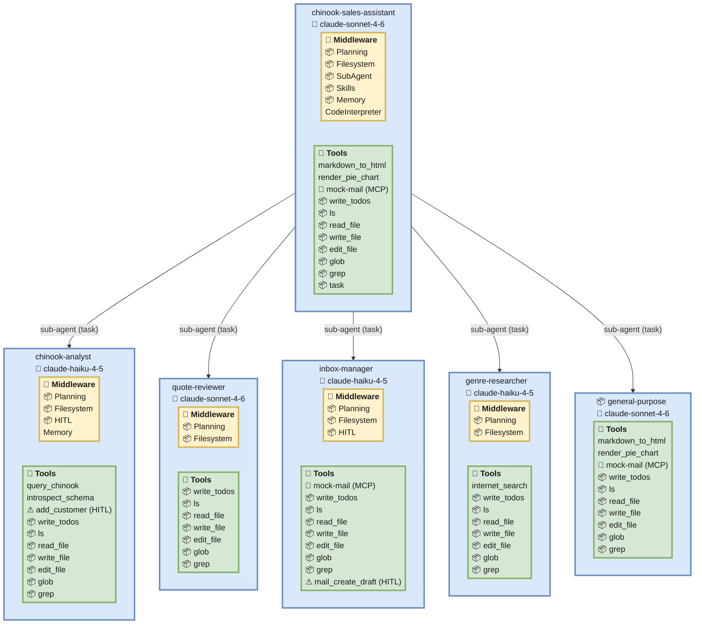

# deepagents-viz

Render a [LangChain DeepAgents](https://docs.langchain.com/oss/python/deepagents/overview)
agent's architecture — subagent hierarchy, tools per agent, HITL gates, and middleware —
as a Mermaid diagram. Extraction is **offline**: no LLM keys, no live services.

## Example

Point it at a real DeepAgents project — here the
[`m5/sales_assistant`](https://github.com/langchain-ai/lca-deepagents/tree/main/python/m5/sales_assistant)
agent from `langchain-ai/lca-deepagents` — and it maps the whole hierarchy: the main agent,
each subagent it can dispatch (`sub-agent (task)` edges), and every agent's model, middleware
(`📦` marks DeepAgents' bundled defaults), tools, and HITL gates (red `⚠`). See
[`examples.md`](examples.md) for the full walkthrough and a legend.



## How it works

`deepagents-viz` monkeypatches `create_deep_agent` so that calling it **records the resolved
arguments and returns a lightweight stand-in — the real agent graph is never compiled.** It
then imports your agent module (calling any factory function, sync or async) to trigger that
call. Dummy env vars and a stubbed MCP client keep the import offline. MCP servers are shown
as an existence badge only.

## Install & run

Once published to PyPI, run it **inside your agent's own environment** (where `deepagents`
and the agent's other dependencies are installed):

```bash
uv run --with deepagents-viz deepagents-viz path/to/agent_dir            # print Mermaid
uv run --with deepagents-viz deepagents-viz path/to/agent_dir -o out.mmd # write a file
uv run --with deepagents-viz deepagents-viz ./agent.py:make_graph        # target a factory
uv run --with deepagents-viz deepagents-viz . --graph agent              # pick a graph
```

`target` may be: a directory containing `langgraph.json`, a `langgraph.json` path, or a
`file.py:attr` spec.

### Running locally (before it's on PyPI)

**Against the bundled test fixtures**, from this repository — `uv run` installs this project
into its own environment, and the fixtures only need `deepagents` (a dev dependency):

```bash
uv run deepagents-viz tests/fixtures/simple              # print Mermaid
uv run deepagents-viz tests/fixtures/factory -o out.mmd  # write a file
# or, without the console script:
uv run python -m deepagents_viz.cli tests/fixtures/simple
```

**Against an agent in another directory**, the tool must run in *that* agent's environment
so all of the agent's own dependencies import. Overlay this checkout onto it with a local
path instead of a package name:

```bash
cd /path/to/other-agent   # a uv project with its own deps + deepagents installed
uv run --with-editable /path/to/deepagents-viz deepagents-viz m5/sales_assistant -o out.mmd
```

The rule either way: **the target's full dependency set must be importable in whatever
environment runs the tool** — which is why an external agent uses its own env plus
`--with-editable`, not this repo's environment.

## Examples

See [`examples.md`](examples.md) for worked, end-to-end walkthroughs: the two bundled test
fixtures (with their commands and rendered Mermaid output) and a full setup for pointing
the tool at an external agent, `m5/sales_assistant`.

## Viewing the diagram

- Paste the output into <https://mermaid.live> (Export → PNG/SVG), or
- drop it in a ```` ```mermaid ```` fenced block in a Markdown file on GitHub.

## Development

```bash
uv sync                        # install dev dependencies (pytest, ruff, pre-commit)
uv run pre-commit install      # enable the git pre-commit hook (once per clone)
uv run pytest                  # run the test suite
uv run ruff check .            # lint
uv run ruff format .           # auto-format
```

The pre-commit hook runs Ruff (lint + format) on staged files. The same checks, plus the
test suite across Python 3.11–3.13, run in CI on every pull request and on pushes to `main`.

## Limitations

- Individual MCP tool names are not resolved (existence badge per server).
- The DeepAgents-bundled middleware and built-in tools (marked with a `📦` prefix — e.g.
  `Planning`, `Filesystem`, `SubAgent`, and their tools) are inferred from the call's
  configuration rather than read back from the composed middleware/tool list.
- Subagents built via nested `create_deep_agent` calls are not modelled (DeepAgents
  uses dicts).

## Roadmap

- Graphviz/DOT renderer for offline PNG/SVG from Python (via the native `dot` binary).
