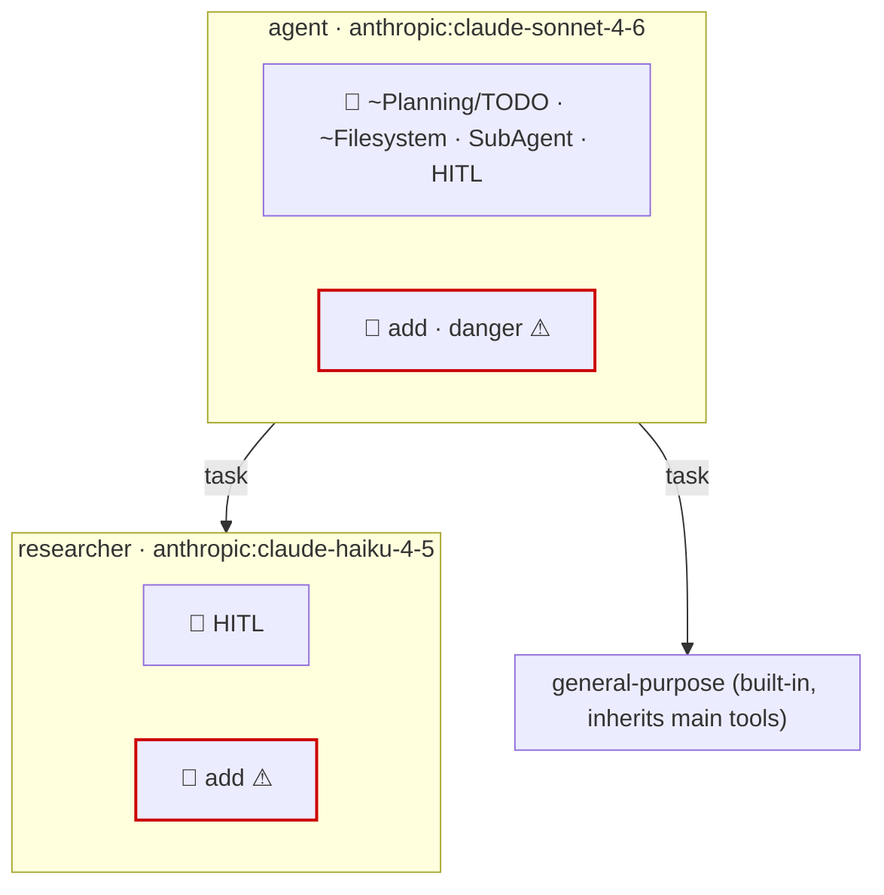
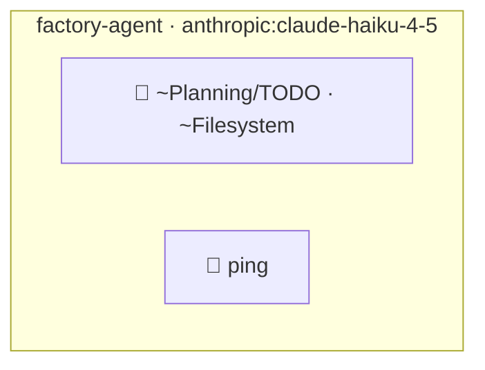

# Examples

Worked examples of generating Mermaid diagrams with `deepagents-viz`. The first two use
the agent fixtures bundled in this repository, so they run with no external setup. The
third walks through pointing the tool at a real, external DeepAgents project.

Each example lists the steps, the exact command, the Mermaid output, and how to read the
resulting diagram.

## How to read the diagrams

- Each agent is a `subgraph` box labelled `name · model`.
- `🧩` lists the agent's **middleware** (e.g. `~Planning/TODO`, `~Filesystem`, `SubAgent`,
  `HITL`). A `~`-prefixed entry is inferred from DeepAgents defaults.
- `🔧` lists the agent's **tools**. A `⚠` suffix and a red border (`:::gated`) mark a tool
  behind a human-in-the-loop (HITL) `interrupt_on` gate.
- `🔌 MCP: <server>` marks an MCP server (shown as an existence badge only — individual
  tool names are not resolved).
- `-->|task|` edges connect a parent agent to each subagent it can dispatch. Every
  DeepAgents agent gets the built-in `general-purpose` subagent automatically.

To view a diagram, paste the Mermaid block into <https://mermaid.live>, or drop it in a
` ```mermaid ` fenced block in a Markdown file on GitHub (as done below).

---

## Example 1 — `simple`: a hand-built agent with a subagent and HITL gates

The fixture lives at [`tests/fixtures/simple/`](tests/fixtures/simple/). Its `agent.py`
builds an agent with two tools (`add`, `danger`), a `researcher` subagent, and two HITL
gates: `danger` on the main agent and `add` on the researcher.

```python
# tests/fixtures/simple/agent.py
from deepagents import create_deep_agent
from langchain_core.tools import tool


@tool
def add(a: int, b: int) -> int:
    """Add two numbers."""
    return a + b


@tool
def danger(x: str) -> str:
    """A gated operation."""
    return x


researcher = {
    "name": "researcher",
    "description": "Researches things.",
    "system_prompt": "You research.",
    "tools": [add],
    "model": "anthropic:claude-haiku-4-5",
    "interrupt_on": {"add": True},
}

agent = create_deep_agent(
    model="anthropic:claude-sonnet-4-6",
    tools=[add, danger],
    system_prompt="Main agent.",
    subagents=[researcher],
    interrupt_on={"danger": True},
)
```

The directory's `langgraph.json` points the tool at the `agent` attribute:

```json
{
  "dependencies": ["."],
  "graphs": { "agent": "./agent.py:agent" }
}
```

### Steps

1. From the repository root, run the tool against the fixture directory. `uv run`
   installs this project into its own environment; the fixture only needs `deepagents`,
   which is a dev dependency here:

   ```bash
   uv run deepagents-viz tests/fixtures/simple
   ```

   The tool locates `langgraph.json`, imports `agent.py`, intercepts the
   `create_deep_agent` call (the real graph is never compiled), and prints Mermaid to
   stdout.

2. To save the diagram to a file instead of stdout, add `-o`:

   ```bash
   uv run deepagents-viz tests/fixtures/simple -o simple.mmd
   ```

### Output

```
graph TD
  classDef gated stroke:#c00,stroke-width:2px;
  subgraph agent["agent · anthropic:claude-sonnet-4-6"]
    agent_mw["🧩 ~Planning/TODO · ~Filesystem · SubAgent · HITL"]
    agent_t["🔧 add · danger ⚠"]:::gated
  end
  agent -->|task| researcher
  subgraph researcher["researcher · anthropic:claude-haiku-4-5"]
    researcher_mw["🧩 HITL"]
    researcher_t["🔧 add ⚠"]:::gated
  end
  agent -->|task| general_purpose
  subgraph general_purpose["general-purpose (built-in, inherits main tools)"]
  end
```

### Rendered



### Reading it

- The main `agent` runs `claude-sonnet-4-6`, carries the default middleware stack plus
  `SubAgent` and `HITL` (because it has subagents and gates), and exposes `add` and
  `danger`. `danger` is gated (`⚠`, red border) via `interrupt_on={"danger": True}`.
- The `researcher` subagent runs `claude-haiku-4-5` with only `add`, which is itself gated
  by the subagent's own `interrupt_on={"add": True}`.
- `general-purpose` is the built-in subagent every DeepAgents agent gets for free; it
  inherits the main agent's tools, so no tools are listed.

---

## Example 2 — `factory`: an async factory function

The fixture lives at [`tests/fixtures/factory/`](tests/fixtures/factory/). Instead of a
module-level agent, it exposes an **async factory** `make_graph`. `deepagents-viz` runs the
factory (offline) to reach the intercepted `create_deep_agent` call.

```python
# tests/fixtures/factory/agent.py
from deepagents import create_deep_agent
from langchain_core.tools import tool


@tool
def ping() -> str:
    """Ping."""
    return "pong"


async def make_graph():
    return create_deep_agent(
        model="anthropic:claude-haiku-4-5",
        tools=[ping],
        system_prompt="Factory-built agent.",
        name="factory-agent",
    )
```

Its `langgraph.json` points the `agent` graph at the factory:

```json
{
  "dependencies": ["."],
  "graphs": { "agent": "./agent.py:make_graph" }
}
```

### Steps

1. Run the tool against the fixture directory. It resolves `langgraph.json`, awaits the
   async `make_graph` factory, and intercepts the resulting `create_deep_agent` call:

   ```bash
   uv run deepagents-viz tests/fixtures/factory
   ```

2. You can also target the factory directly with a `file.py:attr` spec, bypassing
   `langgraph.json`:

   ```bash
   uv run deepagents-viz tests/fixtures/factory/agent.py:make_graph
   ```

### Output

```
graph TD
  classDef gated stroke:#c00,stroke-width:2px;
  subgraph factory_agent["factory-agent · anthropic:claude-haiku-4-5"]
    factory_agent_mw["🧩 ~Planning/TODO · ~Filesystem"]
    factory_agent_t["🔧 ping"]
  end
```

### Rendered



### Reading it

- The agent is named `factory-agent` (from the `name=` argument) and runs
  `claude-haiku-4-5`.
- It carries only the two default-inferred middleware entries (`~Planning/TODO`,
  `~Filesystem`) — there are no subagents (so no `SubAgent`) and no `interrupt_on` gates
  (so no `HITL`).
- Its single tool `ping` is not gated.

---

## Example 3 — an external project: `m5/sales_assistant`

This shows the general workflow for a real DeepAgents project that lives in its own
repository with its own dependencies:
[`langchain-ai/lca-deepagents` → `python/m5/sales_assistant`](https://github.com/langchain-ai/lca-deepagents/tree/main/python/m5/sales_assistant).

Its `langgraph.json` uses an async factory and a shared env file:

```json
{
  "dependencies": ["../.."],
  "graphs": { "agent": "./agent.py:make_graph" },
  "env": "../../.env"
}
```

The key rule (see the README): **the target's full dependency set must be importable in the
environment that runs the tool.** An external agent has its own dependencies that this
repository does not have, so you run the tool *inside the agent's own environment* and
overlay this checkout with `--with-editable`, rather than from this repo's environment.

### Steps

1. **Check out the code.** Clone the repository and change into the `sales_assistant`
   directory:

   ```bash
   git clone https://github.com/langchain-ai/lca-deepagents.git
   cd lca-deepagents/python/m5/sales_assistant
   ```

2. **Set up the environment.** The project is a `uv` project whose dependencies are
   declared at the `python/` root (`dependencies: ["../.."]`). From the `sales_assistant`
   directory, let `uv` resolve and install them:

   ```bash
   uv sync
   ```

   Extraction is **offline** — the tool never calls an LLM or live service. But importing
   the agent module still runs its top-level code, which may read environment variables.
   `deepagents-viz` injects dummy env vars and stubs the MCP client so the import
   succeeds, so you do **not** need real API keys. If the agent reads a specific required
   variable at import time and fails, create the referenced env file with placeholder
   values:

   ```bash
   # only if import fails for a missing variable; placeholders are fine
   cp ../../.env.example ../../.env   # if an example file exists
   # otherwise create ../../.env with the referenced keys set to any placeholder value
   ```

3. **Generate the diagram.** Run `deepagents-viz` from inside the agent's environment,
   overlaying this checkout as an editable dependency. Replace
   `/path/to/deepagents-viz` with the absolute path to your clone of this repository:

   ```bash
   uv run --with-editable /path/to/deepagents-viz deepagents-viz . -o sales_assistant.mmd
   ```

   - `.` targets the current directory, where `langgraph.json` lives.
   - `--with-editable /path/to/deepagents-viz` adds this tool to the `sales_assistant`
     environment without polluting its `pyproject.toml`.
   - `-o sales_assistant.mmd` writes the Mermaid to a file; omit it to print to stdout.

   If `langgraph.json` ever declares more than one graph, disambiguate with `--graph`:

   ```bash
   uv run --with-editable /path/to/deepagents-viz deepagents-viz . --graph agent
   ```

4. **View it.** Paste the contents of `sales_assistant.mmd` into
   <https://mermaid.live>, or embed it in a ` ```mermaid ` fenced block in a Markdown
   file on GitHub.

> The exact diagram depends on how `sales_assistant` is defined at the commit you check
> out — its model, tools, MCP servers, HITL gates, and subagents. Run the command above to
> produce the diagram for your checkout; read it using the legend in
> [How to read the diagrams](#how-to-read-the-diagrams) above.
