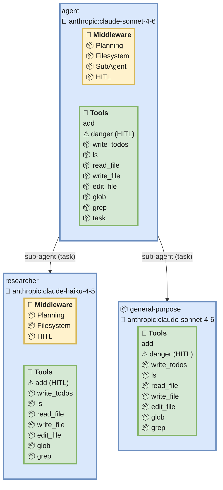
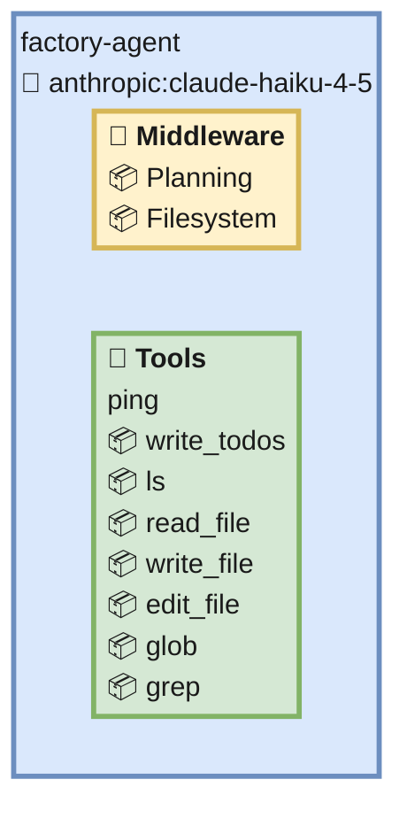
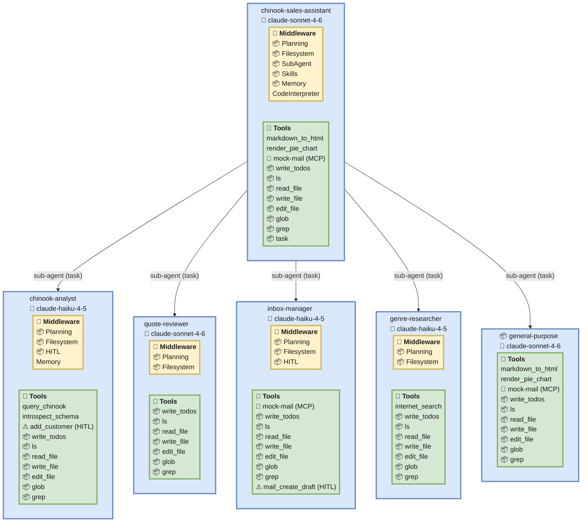

# Examples

Worked examples of generating Mermaid diagrams with `deepagents-viz`. The first two use
the agent fixtures bundled in this repository, so they run with no external setup. The
third walks through pointing the tool at a real, external DeepAgents project.

Each example lists the steps, the exact command, the Mermaid output, and how to read the
resulting diagram.

## How to read the diagrams

- Each agent is a pastel-blue `subgraph` box titled with the agent **name** on the first
  line and `🧠 model` on the second.
- A pastel-yellow `🧩 Middleware` box lists the agent's middleware, one per line. A `📦`
  prefix marks middleware DeepAgents bundles by default (e.g. `📦 Planning`,
  `📦 Filesystem`, `📦 SubAgent`, `📦 HITL`); unprefixed entries are user-supplied.
- A pastel-green `🔧 Tools` box lists the agent's tools, one per line. `📦`-prefixed tools
  are the built-in tools contributed by the bundled middleware (`write_todos`, the
  filesystem tools, `task`). An MCP server appears as `🔌 <server> (MCP)` — an existence
  badge only; individual MCP tool names are not resolved.
- A tool behind a human-in-the-loop (HITL) `interrupt_on` gate is prefixed with a red `⚠`
  and suffixed `(HITL)`. A gate on an MCP tool (whose name we can't resolve to the badge)
  is shown as its own `⚠ <name> (HITL)` line.
- `sub-agent (task)` edges connect a parent agent to each subagent it can dispatch. Every
  DeepAgents agent gets the built-in `general-purpose` subagent automatically (shown with
  a `📦` prefix). It inherits the main agent's model and tools but is *not* given the
  `task` tool, so it cannot itself spawn further subagents.

To view a diagram, paste the Mermaid block into <https://mermaid.live>, or drop it in a
` ```mermaid ` fenced block in a Markdown file on GitHub (as done below).

---

## Example 1 — `simple`: a hand-built agent with a subagent and HITL gates

The fixture lives at [`tests/fixtures/simple/`](tests/fixtures/simple/). Its `agent.py`
builds an agent with two tools (`add`, `danger`), a `researcher` subagent, and two HITL
gates: `danger` on the main agent and `add` on the researcher.

```python
# tests/fixtures/simple/agent.py
from deepagents import create_deep_agent
from langchain_core.tools import tool


@tool
def add(a: int, b: int) -> int:
    """Add two numbers."""
    return a + b


@tool
def danger(x: str) -> str:
    """A gated operation."""
    return x


researcher = {
    "name": "researcher",
    "description": "Researches things.",
    "system_prompt": "You research.",
    "tools": [add],
    "model": "anthropic:claude-haiku-4-5",
    "interrupt_on": {"add": True},
}

agent = create_deep_agent(
    model="anthropic:claude-sonnet-4-6",
    tools=[add, danger],
    system_prompt="Main agent.",
    subagents=[researcher],
    interrupt_on={"danger": True},
)
```

The directory's `langgraph.json` points the tool at the `agent` attribute:

```json
{
  "dependencies": ["."],
  "graphs": { "agent": "./agent.py:agent" }
}
```

### Steps

1. From the repository root, run the tool against the fixture directory. `uv run`
   installs this project into its own environment; the fixture only needs `deepagents`,
   which is a dev dependency here:

   ```bash
   uv run deepagents-viz tests/fixtures/simple
   ```

   The tool locates `langgraph.json`, imports `agent.py`, intercepts the
   `create_deep_agent` call (the real graph is never compiled), and prints Mermaid to
   stdout.

2. To save the diagram to a file instead of stdout, add `-o`:

   ```bash
   uv run deepagents-viz tests/fixtures/simple -o simple.mmd
   ```

### Output

```
%%{init: {'flowchart': {'subGraphTitleMargin': {'top': 6, 'bottom': 16}, 'padding': 4}}}%%
graph TD
  classDef mwBox fill:#fff2cc,stroke:#d6b656,stroke-width:3px,color:#1a1a1a;
  classDef toolBox fill:#d5e8d4,stroke:#82b366,stroke-width:3px,color:#1a1a1a;
  subgraph agent["agent<br/>🧠 anthropic:claude-sonnet-4-6"]
    agent_mw["<div style='text-align:left'>🧩 <b>Middleware</b><br/>📦 Planning<br/>📦 Filesystem<br/>📦 SubAgent<br/>📦 HITL</div>"]:::mwBox
    agent_t["<div style='text-align:left'>🔧 <b>Tools</b><br/>add<br/><span style='color:#c00'>⚠</span> danger (HITL)<br/>📦 write_todos<br/>📦 ls<br/>📦 read_file<br/>📦 write_file<br/>📦 edit_file<br/>📦 glob<br/>📦 grep<br/>📦 task</div>"]:::toolBox
  end
  agent -->|"sub-agent (task)"| researcher
  subgraph researcher["researcher<br/>🧠 anthropic:claude-haiku-4-5"]
    researcher_mw["<div style='text-align:left'>🧩 <b>Middleware</b><br/>📦 Planning<br/>📦 Filesystem<br/>📦 HITL</div>"]:::mwBox
    researcher_t["<div style='text-align:left'>🔧 <b>Tools</b><br/><span style='color:#c00'>⚠</span> add (HITL)<br/>📦 write_todos<br/>📦 ls<br/>📦 read_file<br/>📦 write_file<br/>📦 edit_file<br/>📦 glob<br/>📦 grep</div>"]:::toolBox
  end
  agent -->|"sub-agent (task)"| general_purpose
  subgraph general_purpose["📦 general-purpose<br/>🧠 anthropic:claude-sonnet-4-6"]
    general_purpose_t["<div style='text-align:left'>🔧 <b>Tools</b><br/>add<br/><span style='color:#c00'>⚠</span> danger (HITL)<br/>📦 write_todos<br/>📦 ls<br/>📦 read_file<br/>📦 write_file<br/>📦 edit_file<br/>📦 glob<br/>📦 grep</div>"]:::toolBox
  end
  style agent fill:#dae8fc,stroke:#6c8ebf,stroke-width:3px,color:#1a1a1a;
  style researcher fill:#dae8fc,stroke:#6c8ebf,stroke-width:3px,color:#1a1a1a;
  style general_purpose fill:#dae8fc,stroke:#6c8ebf,stroke-width:3px,color:#1a1a1a;
```

### Rendered



### Reading it

- The main `agent` runs `claude-sonnet-4-6` and carries the default middleware stack plus
  `📦 SubAgent` and `📦 HITL` (because it has subagents and gates). Its tools are the
  user-defined `add` and `danger`, followed by the `📦`-prefixed built-ins from Planning,
  Filesystem, and SubAgent. `danger` is gated (red `⚠`, `(HITL)`) via
  `interrupt_on={"danger": True}`.
- The `researcher` subagent runs `claude-haiku-4-5`. Its own tool `add` is gated by the
  subagent's `interrupt_on={"add": True}`. DeepAgents also gives every declarative subagent
  the default Planning + Filesystem stack, so it too carries those `📦` middleware and their
  built-in tools — but **not** `SubAgent`/`task`, since subagents can't spawn subagents.
- `general-purpose` is the built-in subagent every DeepAgents agent gets for free. It
  inherits the main agent's model and tools (so `add`/`danger` appear, `danger` still
  gated) plus the Planning/Filesystem built-ins — but note it has **no `task` tool**, so
  unlike the main agent it cannot dispatch subagents.

---

## Example 2 — `factory`: an async factory function

The fixture lives at [`tests/fixtures/factory/`](tests/fixtures/factory/). Instead of a
module-level agent, it exposes an **async factory** `make_graph`. `deepagents-viz` runs the
factory (offline) to reach the intercepted `create_deep_agent` call.

```python
# tests/fixtures/factory/agent.py
from deepagents import create_deep_agent
from langchain_core.tools import tool


@tool
def ping() -> str:
    """Ping."""
    return "pong"


async def make_graph():
    return create_deep_agent(
        model="anthropic:claude-haiku-4-5",
        tools=[ping],
        system_prompt="Factory-built agent.",
        name="factory-agent",
    )
```

Its `langgraph.json` points the `agent` graph at the factory:

```json
{
  "dependencies": ["."],
  "graphs": { "agent": "./agent.py:make_graph" }
}
```

### Steps

1. Run the tool against the fixture directory. It resolves `langgraph.json`, awaits the
   async `make_graph` factory, and intercepts the resulting `create_deep_agent` call:

   ```bash
   uv run deepagents-viz tests/fixtures/factory
   ```

2. You can also target the factory directly with a `file.py:attr` spec, bypassing
   `langgraph.json`:

   ```bash
   uv run deepagents-viz tests/fixtures/factory/agent.py:make_graph
   ```

### Output

```
%%{init: {'flowchart': {'subGraphTitleMargin': {'top': 6, 'bottom': 16}, 'padding': 4}}}%%
graph TD
  classDef mwBox fill:#fff2cc,stroke:#d6b656,stroke-width:3px,color:#1a1a1a;
  classDef toolBox fill:#d5e8d4,stroke:#82b366,stroke-width:3px,color:#1a1a1a;
  subgraph factory_agent["factory-agent<br/>🧠 anthropic:claude-haiku-4-5"]
    factory_agent_mw["<div style='text-align:left'>🧩 <b>Middleware</b><br/>📦 Planning<br/>📦 Filesystem</div>"]:::mwBox
    factory_agent_t["<div style='text-align:left'>🔧 <b>Tools</b><br/>ping<br/>📦 write_todos<br/>📦 ls<br/>📦 read_file<br/>📦 write_file<br/>📦 edit_file<br/>📦 glob<br/>📦 grep</div>"]:::toolBox
  end
  style factory_agent fill:#dae8fc,stroke:#6c8ebf,stroke-width:3px,color:#1a1a1a;
```

### Rendered



### Reading it

- The agent is named `factory-agent` (from the `name=` argument) and runs
  `claude-haiku-4-5`.
- It carries only the two default-bundled middleware entries (`📦 Planning`,
  `📦 Filesystem`) — there are no subagents (so no `SubAgent`) and no `interrupt_on` gates
  (so no `HITL`).
- Its tools are the user-defined `ping`, followed by the `📦`-prefixed built-ins from
  Planning (`write_todos`) and Filesystem (`ls`, `read_file`, …). Nothing is gated.

---

## Example 3 — an external project: `m5/sales_assistant`

This shows the general workflow for a real DeepAgents project that lives in its own
repository with its own dependencies:
[`langchain-ai/lca-deepagents` → `python/m5/sales_assistant`](https://github.com/langchain-ai/lca-deepagents/tree/main/python/m5/sales_assistant).

Its `langgraph.json` uses an async factory and a shared env file:

```json
{
  "dependencies": ["../.."],
  "graphs": { "agent": "./agent.py:make_graph" },
  "env": "../../.env"
}
```

The key rule (see the [README](README.md)): **the target's full dependency set must be importable in the
environment that runs the tool.** An external agent has its own dependencies that this
repository does not have, so you run the tool *inside the agent's own environment* and
overlay this checkout with `--with-editable`, rather than from this repo's environment.

### Steps

1. **Check out the code.** Clone the repository and change into the `sales_assistant`
   directory:

   ```bash
   git clone https://github.com/langchain-ai/lca-deepagents.git
   cd lca-deepagents/python/m5/sales_assistant
   ```

2. **Set up the environment.** The project is a `uv` project whose dependencies are
   declared at the `python/` root (`dependencies: ["../.."]`). From the `sales_assistant`
   directory, let `uv` resolve and install them:

   ```bash
   uv sync
   ```

   Extraction is **offline** — the tool never calls an LLM or live service. But importing
   the agent module still runs its top-level code, which may read environment variables.
   `deepagents-viz` injects dummy env vars and stubs the MCP client so the import
   succeeds, so you do **not** need real API keys. If the agent reads a specific required
   variable at import time and fails, create the referenced env file with placeholder
   values:

   ```bash
   # only if import fails for a missing variable; placeholders are fine
   cp ../../.env.example ../../.env   # if an example file exists
   # otherwise create ../../.env with the referenced keys set to any placeholder value
   ```

3. **Generate the diagram.** Run `deepagents-viz` from inside the agent's environment,
   overlaying this checkout as an editable dependency. Replace
   `/path/to/deepagents-viz` with the absolute path to your clone of this repository:

   ```bash
   uv run --with-editable /path/to/deepagents-viz deepagents-viz . -o sales_assistant.mmd
   ```

   - `.` targets the current directory, where `langgraph.json` lives.
   - `--with-editable /path/to/deepagents-viz` adds this tool to the `sales_assistant`
     environment without polluting its `pyproject.toml`.
   - `-o sales_assistant.mmd` writes the Mermaid to a file; omit it to print to stdout.

   If `langgraph.json` ever declares more than one graph, disambiguate with `--graph`:

   ```bash
   uv run --with-editable /path/to/deepagents-viz deepagents-viz . --graph agent
   ```

4. **View it.** Paste the contents of `sales_assistant.mmd` into
   <https://mermaid.live>, or embed it in a ` ```mermaid ` fenced block in a Markdown
   file on GitHub.

### Output

Running the steps above against the `main` branch of `lca-deepagents` (with no API keys
set — extraction is offline) produces:

```
%%{init: {'flowchart': {'subGraphTitleMargin': {'top': 6, 'bottom': 16}, 'padding': 4}}}%%
graph TD
  classDef mwBox fill:#fff2cc,stroke:#d6b656,stroke-width:3px,color:#1a1a1a;
  classDef toolBox fill:#d5e8d4,stroke:#82b366,stroke-width:3px,color:#1a1a1a;
  subgraph chinook_sales_assistant["chinook-sales-assistant<br/>🧠 claude-sonnet-4-6"]
    chinook_sales_assistant_mw["<div style='text-align:left'>🧩 <b>Middleware</b><br/>📦 Planning<br/>📦 Filesystem<br/>📦 SubAgent<br/>📦 Skills<br/>📦 Memory<br/>CodeInterpreter</div>"]:::mwBox
    chinook_sales_assistant_t["<div style='text-align:left'>🔧 <b>Tools</b><br/>markdown_to_html<br/>render_pie_chart<br/>🔌 mock-mail (MCP)<br/>📦 write_todos<br/>📦 ls<br/>📦 read_file<br/>📦 write_file<br/>📦 edit_file<br/>📦 glob<br/>📦 grep<br/>📦 task</div>"]:::toolBox
  end
  chinook_sales_assistant -->|"sub-agent (task)"| chinook_analyst
  subgraph chinook_analyst["chinook-analyst<br/>🧠 claude-haiku-4-5"]
    chinook_analyst_mw["<div style='text-align:left'>🧩 <b>Middleware</b><br/>📦 Planning<br/>📦 Filesystem<br/>📦 HITL<br/>Memory</div>"]:::mwBox
    chinook_analyst_t["<div style='text-align:left'>🔧 <b>Tools</b><br/>query_chinook<br/>introspect_schema<br/><span style='color:#c00'>⚠</span> add_customer (HITL)<br/>📦 write_todos<br/>📦 ls<br/>📦 read_file<br/>📦 write_file<br/>📦 edit_file<br/>📦 glob<br/>📦 grep</div>"]:::toolBox
  end
  chinook_sales_assistant -->|"sub-agent (task)"| quote_reviewer
  subgraph quote_reviewer["quote-reviewer<br/>🧠 claude-sonnet-4-6"]
    quote_reviewer_mw["<div style='text-align:left'>🧩 <b>Middleware</b><br/>📦 Planning<br/>📦 Filesystem</div>"]:::mwBox
    quote_reviewer_t["<div style='text-align:left'>🔧 <b>Tools</b><br/>📦 write_todos<br/>📦 ls<br/>📦 read_file<br/>📦 write_file<br/>📦 edit_file<br/>📦 glob<br/>📦 grep</div>"]:::toolBox
  end
  chinook_sales_assistant -->|"sub-agent (task)"| inbox_manager
  subgraph inbox_manager["inbox-manager<br/>🧠 claude-haiku-4-5"]
    inbox_manager_mw["<div style='text-align:left'>🧩 <b>Middleware</b><br/>📦 Planning<br/>📦 Filesystem<br/>📦 HITL</div>"]:::mwBox
    inbox_manager_t["<div style='text-align:left'>🔧 <b>Tools</b><br/>🔌 mock-mail (MCP)<br/>📦 write_todos<br/>📦 ls<br/>📦 read_file<br/>📦 write_file<br/>📦 edit_file<br/>📦 glob<br/>📦 grep<br/><span style='color:#c00'>⚠</span> mail_create_draft (HITL)</div>"]:::toolBox
  end
  chinook_sales_assistant -->|"sub-agent (task)"| genre_researcher
  subgraph genre_researcher["genre-researcher<br/>🧠 claude-haiku-4-5"]
    genre_researcher_mw["<div style='text-align:left'>🧩 <b>Middleware</b><br/>📦 Planning<br/>📦 Filesystem</div>"]:::mwBox
    genre_researcher_t["<div style='text-align:left'>🔧 <b>Tools</b><br/>internet_search<br/>📦 write_todos<br/>📦 ls<br/>📦 read_file<br/>📦 write_file<br/>📦 edit_file<br/>📦 glob<br/>📦 grep</div>"]:::toolBox
  end
  chinook_sales_assistant -->|"sub-agent (task)"| general_purpose
  subgraph general_purpose["📦 general-purpose<br/>🧠 claude-sonnet-4-6"]
    general_purpose_t["<div style='text-align:left'>🔧 <b>Tools</b><br/>markdown_to_html<br/>render_pie_chart<br/>🔌 mock-mail (MCP)<br/>📦 write_todos<br/>📦 ls<br/>📦 read_file<br/>📦 write_file<br/>📦 edit_file<br/>📦 glob<br/>📦 grep</div>"]:::toolBox
  end
  style chinook_sales_assistant fill:#dae8fc,stroke:#6c8ebf,stroke-width:3px,color:#1a1a1a;
  style chinook_analyst fill:#dae8fc,stroke:#6c8ebf,stroke-width:3px,color:#1a1a1a;
  style quote_reviewer fill:#dae8fc,stroke:#6c8ebf,stroke-width:3px,color:#1a1a1a;
  style inbox_manager fill:#dae8fc,stroke:#6c8ebf,stroke-width:3px,color:#1a1a1a;
  style genre_researcher fill:#dae8fc,stroke:#6c8ebf,stroke-width:3px,color:#1a1a1a;
  style general_purpose fill:#dae8fc,stroke:#6c8ebf,stroke-width:3px,color:#1a1a1a;
```

### Rendered



### Reading it

- The main `chinook-sales-assistant` runs `claude-sonnet-4-6` with a rich middleware
  stack: the DeepAgents defaults (`📦 Planning`, `📦 Filesystem`) plus `📦 SubAgent`,
  `📦 Skills`, `📦 Memory`, and a user-supplied `CodeInterpreter` (no `📦` — it isn't a
  DeepAgents default). Its tools are the user-defined `markdown_to_html` and
  `render_pie_chart`, the `mock-mail` MCP server (badge only), and the `📦` built-ins from
  its bundled middleware (including `task`, since it has `SubAgent`).
- Four declared subagents fan out from it. DeepAgents gives *every* declarative subagent
  the default Planning + Filesystem stack, so each carries those `📦` middleware and their
  built-in tools (`write_todos`, `ls`, …) — but none gets `SubAgent`/`task`, so no subagent
  can spawn further subagents:
  - `chinook-analyst` (`claude-haiku-4-5`) adds its own `Memory` middleware and a gated
    `add_customer` tool (red `⚠`, `(HITL)`) alongside `query_chinook` and
    `introspect_schema`.
  - `inbox-manager` (`claude-haiku-4-5`) works through the `mock-mail` MCP server and gates
    `mail_create_draft`. Because individual MCP tool names aren't resolved, that gate can't
    attach to the badge, so it appears as its own `⚠ mail_create_draft (HITL)` line. (Note
    the main agent has the same `mock-mail` server but no such gate — its mail access is
    ungated.)
  - `genre-researcher` (`claude-haiku-4-5`) adds an `internet_search` tool.
  - `quote-reviewer` (`claude-sonnet-4-6`) declares no tools of its own, so it shows just
    the inherited default stack.
- `general-purpose` is the built-in subagent (prefixed `📦`). It inherits the main model
  and the main agent's custom tools (`markdown_to_html`, `render_pie_chart`, `mock-mail`)
  plus the Planning/Filesystem built-ins — but **not** `task`, so it cannot spawn further
  subagents.

> The exact diagram depends on how `sales_assistant` is defined at the commit you check
> out — its model, tools, MCP servers, HITL gates, and subagents. The output above is from
> the `main` branch at the time of writing; re-run the command for your checkout and read
> it using the legend in [How to read the diagrams](#how-to-read-the-diagrams) above.
